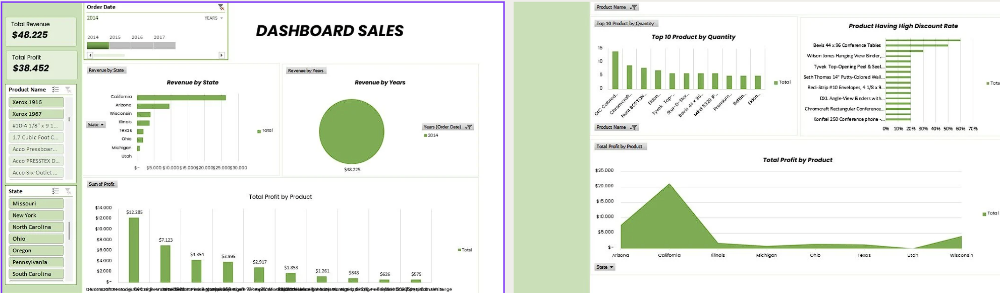

# 📊 Sales Dashboard Analysis  (2014)

  
## 📌 Project Overview  
This project focuses on analyzing sales performance and profitability using an interactive dashboard. The goal is to identify key revenue drivers, evaluate product performance, and provide actionable insights for business growth.  

The dashboard presents:  
- **Total Revenue & Profit**  
- **Revenue distribution by state and year**  
- **Top-selling products by quantity**  
- **Profit contribution by product**  
- **Impact of discounts on products**  

---

## 🔑 Key Metrics  
- **Total Revenue**: **$48,225**  
- **Total Profit**: **$38,452**  
- **Year Analyzed**: 2014  

---

## 📈 Insights  

### 1. Revenue by State  
- **California** dominates revenue with over $25,000 contribution.  
- Arizona and Wisconsin follow, while other states contribute minimally.  
- Revenue concentration is heavily skewed toward California.  

👉 *Insight*: California is the strongest market; marketing and distribution efforts should be prioritized here.  

---

### 2. Revenue by Year  
- The dashboard shows only **2014** with $48,225 in total revenue.   

👉 *Insight*: Adding more years will help identify long-term growth trends.  

---

### 3. Profit by Product  
- Top profit contributors:  
  - **Xerox 1916** → $12,285  
  - **Xerox 1967** → $7,123  
- Other products generated less than $5,000 each.  

👉 *Insight*: Xerox products are highly profitable and should remain a core focus.  

---

### 4. Top 10 Products by Quantity  
- Best-selling products include **Conference Tables, Xerox papers, Tyvek Peel & Seal, and Binders**.  
- However, high sales volume does not always equal high profit.  

👉 *Insight*: Reevaluate pricing to align high-volume products with profitability.  

---

### 5. Products with High Discount Rate  
- **Bevis 44 x 96 Conference Tables** had the highest discount (~70%).  
- Other highly discounted products include **Binders, Tyvek Peel & Seal, and Wall Clocks**.  

👉 *Insight*: Discounts drive sales volume but may reduce margins—discount strategies need optimization.  

---

### 6. Profit by State  
- **California** again leads in profitability.  
- Other states show low or near-zero profit contribution.  

👉 *Insight*: Heavy reliance on California poses a risk; market diversification is needed.  

---

## 💡 Recommendations  
1. **Strengthen California market** through promotions and logistics optimization.  
2. **Diversify sales across states** to reduce dependency on one region.  
3. **Reassess discount strategies** for better balance between sales and profit.  
4. **Focus on Xerox product line** as the primary profit driver.  
5. **Expand analysis with multi-year data** to identify growth trends.  

---

## 🛠 Tools Used  
- **Microsoft Excel** → Data cleaning, Pivot Tables, and Dashboard design  
- **Charts & Visualizations** → Bar, Pie, and Line charts for insights  

✨ *This analysis demonstrates end-to-end data storytelling — from exploration and visualization to actionable business recommendations.*  
